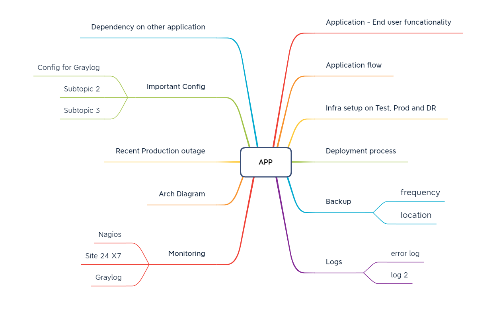
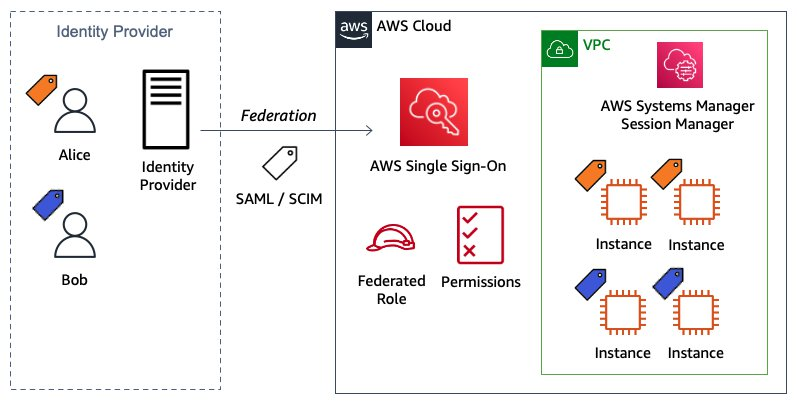

# NETOPS2020

# Heading Level 1
## Heading Level 2

I am working on the project 'How to document our Processes and imporant information

It will take time but it will be versioned document.

- [Architecture diagram](# ABC)
  * [abc](#sub-heading)
    + [Sub-sub-heading](#sub-sub-heading)
- [Heading](#heading-1)
  * [Sub-heading](#sub-heading-1)
    + [Sub-sub-heading](#sub-sub-heading-1)
- [Heading](#heading-2)
  * [Sub-heading](#sub-heading-2)
    + [Sub-sub-heading](#sub-sub-heading-2)

## 

  

# Application Name

## ABC

  

# Conclusion
In this blog post, you learned how to use AWS IAM Identity Center with the two methods of passing attributes to AWS account using session tags for ABAC. You also learned how to build policies with tags as conditions to simplify and reuse custom permission sets. You have seen working examples with services like EC2, and Systems Manager Session Manager. To learn more about ABAC policies, SAML session tags, and how to pass session tags in federation, see IAM tutorial: Use SAML session tags for ABAC and Passing session tags using AssumeRoleWithSAML.

- [Heading](#heading)
  * [Sub-heading](#sub-heading)
    + [Sub-sub-heading](#sub-sub-heading)
- [Heading](#heading-1)
  * [Sub-heading](#sub-heading-1)
    + [Sub-sub-heading](#sub-sub-heading-1)
- [Heading](#heading-2)
  * [Sub-heading](#sub-heading-2)
    + [Sub-sub-heading](#sub-sub-heading-2)

# Heading levels

> This is a fixture to test heading levels

<!-- toc -->

## Heading

This is an h1 heading

### Sub-heading

This is an h2 heading

#### Sub-sub-heading

This is an h3 heading

## Heading

This is an h1 heading

### Sub-heading

This is an h2 heading

#### Sub-sub-heading

This is an h3 heading

## Heading

This is an h1 heading

### Sub-heading

This is an h2 heading

#### Sub-sub-heading

This is an h3 heading
